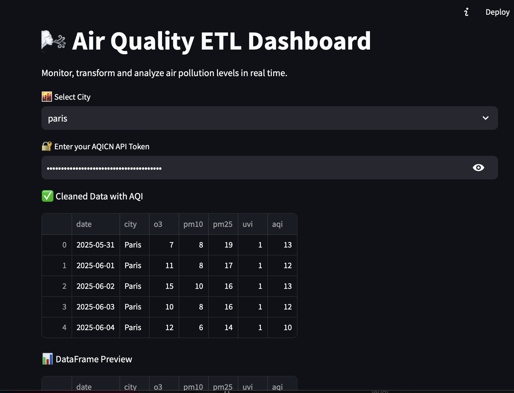
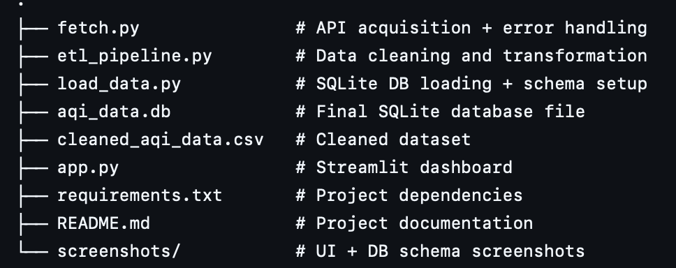
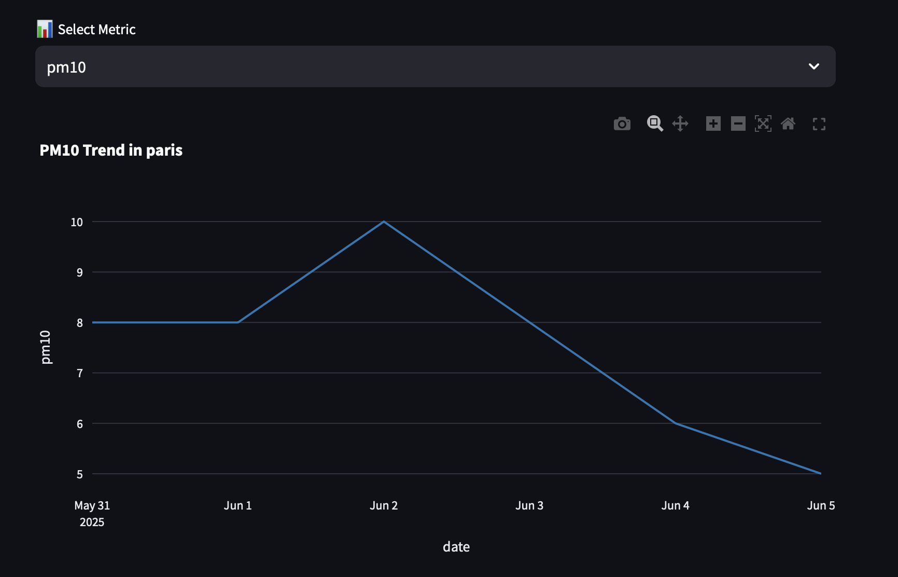

🌍 Air Quality ETL & Dashboard App

A full ETL pipeline and data visualization platform for real-time air quality monitoring. This project was designed to meet the requirements of a data engineering assessment focused on Data Acquisition and ETL Processes.

📌 Why This Project?
End-to-end ETL pipeline (Extract, Transform, Load)
Real-time API integration with robust error handling
Data quality assurance and transformation best practices
Relational database design (SQLite)
Streamlit dashboard for clear, interactive insights

🛠 Project Features

Step	Description
1. Data Acquisition	Live data from Open AQ API. Error-handling for rate limits and nulls.
2. Data Cleaning	Removes duplicates, fills missing values, and standardizes formats (e.g., dates, units).
3. Data Transformation	Normalization, calculated fields (e.g., pollution indexes), data type consistency.
4. Data Loading	Loads into a normalized SQLite relational database.
5. Visualization	Interactive Streamlit dashboard with Plotly, Altair, and AgGrid.
🧱 Database Design
   
📁 Repository Structure

🚀 Setup Instructions

Clone the repo:
git clone https://github.com/hajar365/etl_project.git
cd air-quality-etl
(Optional) Create a virtual environment:
python -m venv venv
source venv/bin/activate
Install dependencies:
pip install -r requirements.txt
▶️ Running the ETL Pipeline

Fetch data
python fetch.py
Clean & transform
python etl_pipeline.py
Load to database
python load_data.py
🌐 View the Dashboard

✅ Deployed App: https://commonshare-etlproject.streamlit.app

📌 Note: API token is not required to view the dashboard.

🧪 How This Matches the PROJECT's Test

Requirement	Implemented?	   Notes
Fetch from API		           Using Open AQ API
Handle API errors		       Includes rate-limit handling and missing data
Clean & normalize		       Unit normalization, deduplication, date standardization
Transform data		           Added pollution indexes, normalization
Load to relational DB	     SQLite with structured schema
Use automation/pipeline		   Modular scripts for each ETL phase
Visual output		           Live Streamlit dashboard with graphs & tables
📈 Sample Visualizations

🧠 Technologies Used

Python 3.12
Streamlit
Pandas & NumPy
Plotly, Seaborn, Altair
SQLite
Requests
dotenv (for API key mgmt)
Streamlit-AgGrid
💡 Possible Extensions

Automate ETL via Airflow / Prefect
Add login & role-based access to the dashboard
Push data to cloud warehouse (BigQuery, Snowflake)

📬 Contact

Made with ❤️ by EL HADRI HAJAR
📧 Email: hdrihajar@gmail.com
🔗 GitHub: github.com/hajar365
